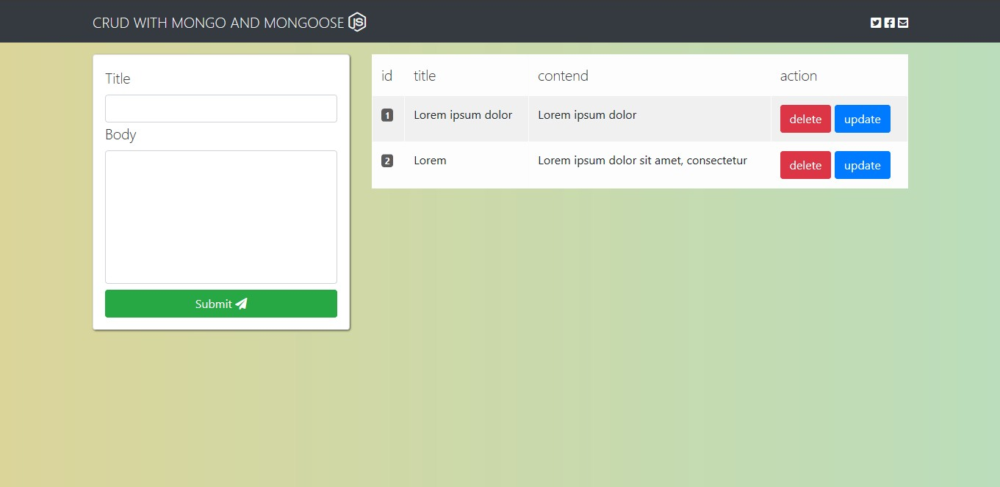

# mongodb-crud

## description
```
Small personal task list where you can create, edit, and delete tasks you're typing.  (CRUD) using mongodb database as a mongodb database
```

### author
> Leonibel SR [github](https://github.com/LeonibelDev "see my projects in github") or [facebook](https://facebook.com/ "contact me in facebook")

## main file
> app.js 

## tree / structure
* config
* static
  * css
  * js
* views
  * layouts

## for execute
* Install the node modules run -> **npm install**

## screenshot
